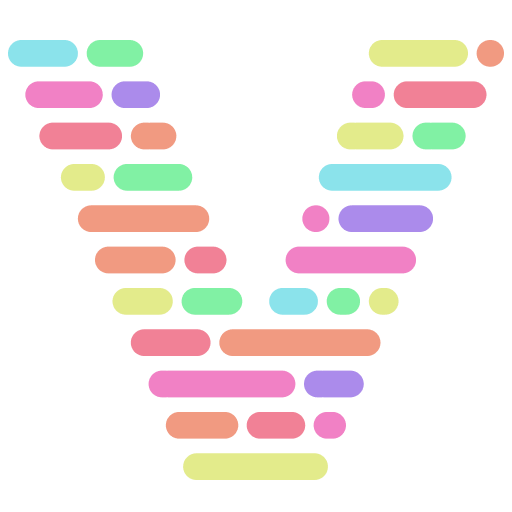

 

 

# Vicious Vault

Welcome to the Vicious Vault repository! This repository is dedicated to helping developers and designers test and visualize the Vicious theme, a dark mode theme, in Visual Studio Code (VSCode).

Vicious Vault provides a collection of dummy code files specifically designed to showcase the Vicious theme's color scheme and appearance in VSCode. It serves as a valuable resource for developers and designers who want to preview and fine-tune their code's visual presentation in a dark mode environment.

# How to Use Vicious Vault?

Inside the repository, you'll find a variety of sample code files that cover different programming languages and file formats. These files are carefully crafted to demonstrate how the Vicious theme's color scheme is applied to syntax highlighting and other code elements.

The repository includes templates for the following popular file extensions:

- C
- C++
- Clojure
- C#
- CSS
- Dart
- Go
- HTML
- Java
- JavaScript
- JSON
- Markdown
- PHP
- Python
- Ruby
- Rust
- Swift
- TypeScript
- YAML

Feel free to explore and experiment with these code files in your Visual Studio Code editor to visualize how your code will look and feel with the Vicious theme applied.

# Contribute to Vicious Vault

I encourage contributions to the Vicious Vault repository. If you have new code files or want to improve existing ones, please feel free to submit pull requests. Together, I can enhance the collection and provide developers and designers with a valuable resource for testing and refining their dark mode coding experiences.

Make your code shine in the Vicious theme!
